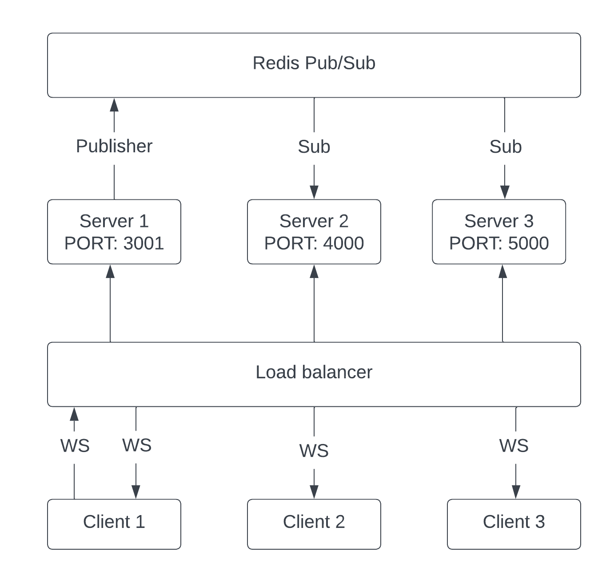
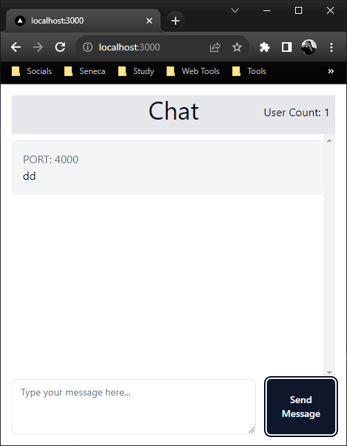
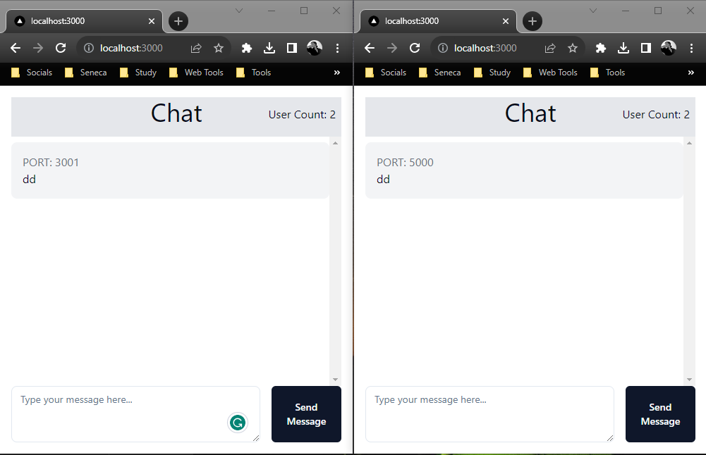

# Scalable Chat Backend Architecture
This is a Chat application backend made using Redis and WebSockers that is horizontally scalable. This architecture offers robust scalability and real time performace using redis.

## System Architecture

The system comprises multiple servers, all orchestrated through a load balancer. These servers interact with a centralized Redis client, which handles event management. In a typical use-case scenario illustrated in the accompanying diagram a message sent by Client 1 to Server 1 gets published in Redis. Subsequently, the remaining servers, which are subscribed to this particular event, disseminate the message to other connected clients.

## Overview 
- The realtime communication is implemented using WebSockets.
- Used Redis Pub/Sub to communicate accross different instances.
- Used Docker to create different instances of the servers.
- Graceful Shut downs for the servers so that the data is updated correctly.

## When one user is connected, and sends a message:
We can see that the user is connected to port 4000 and there is just one user connected at the moment.  

## When another user connects:
When an additional user joins the system, the user count is dynamically updated. Messages can be exchanged between users, regardless of the server or port to which they are connected. The architecture thus supports concurrent multi-user chat sessions, as visualized in the following diagram.

